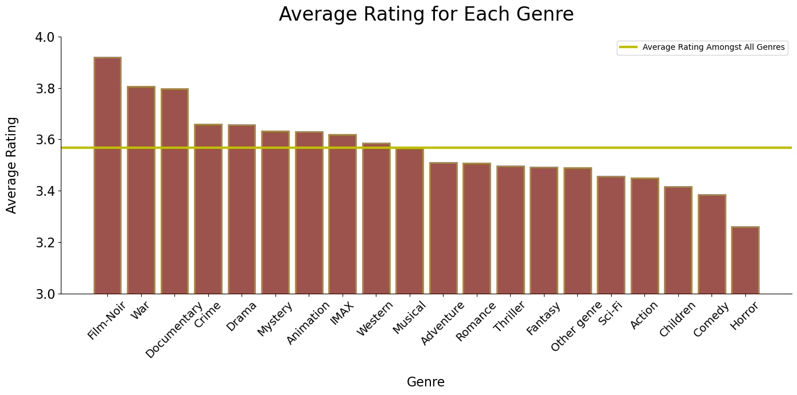

# Movie Recommendation Systems 
**Data Science Students:**  John Bruemmer, Juliet Day, Xibei(Julian) He  
**Date:** June 23, 2022

## **Overview**
The goal to be achieved in this project is to build a quantitative model to generate top 5 movie recommendations for any user. The data we used includes roughly 100,000 ratings across 610 unique users. We utilized a collaborative system so the model would make it's predictions based on user's ratings on other movies. We are presenting our final product to Netflix Recommendation Solution Team, lead by tech supervisor and CTO who oversee the application of algorithms in Netflix's recommendation system.

 

## **Business Understanding**
Business Understanding: As of 2022, Netflix had a total of 222 million paid members globally. With many accounts having multiple people per household using one account, that would mean many more users. A study in 2016 found that the average person in the United States spends approximately 23 minutes a day trying to find something to watch. “Breaking that down even further, that works out to be 474 days of unsatisfying, desperate attempts to find anything to satiate the need for new programming before returning to Friends for the hundredth time.” With a total of 6 billion hours of streaming per month on Netflix and a shocking 474 days of searching for shows to watch per person in their lifetime, it is imperative that customers have custom recommendations based on their favorite previously watched shows and movies. The aim of this project is to create a recommendation system that would customize the user’s recommendations based on their previous ratings.

 

## **Data Understanding** 
The data we used for this project is from Grouplens. The datasets contains 100,830 ratings on over 9,700 movies, posted by 610 users. There are also 3,600 tags related to these movies. The release year of movies recorded are from 1995 - 2018. We will set "rating" as our target variable in developing recommendation model.

### **EDA**
First let’s look at this chart of distribution of movie ratings, where the majority of ratings are centered around 3 and 4. Further, roughly 70% of the ratings are a 3 or above. 

 

This second graph shows the average rating for each genre. Compared to the average rating of 3.58, **Flim-Noir**, **War**, and **Documentary** are likely to receive a higher score on average. **Crime, Drama, Mystery, Animation, IMAX**, and **Western** are among the second tier rated above-average. 

 

## **Data Modeling & Recommendation Result**
The data was analyzed on many fronts. First, we conducted a simple correlation matrix between users and movie ratings to understand how well specific movie ratings are correlated. This provided the basis for our model moving forward. As seen in the Bourne Identity example, the movies that were most correlated were the other movies in the Bourne trilogy. However, there were some movies that we were surprised to find were strongly correlated, such as "The Santa Clause".  

 

After seeing the correlation matrix, a baseline model was fit on our training data. A normal predictor was used as the baseline. This assigns a random rating for a movie based off a normal distribution for the movie around the mean. The RMSE for this model was 1.42. 

Next, we tried a number of different models with base settings to see which we would like to invest time grid searching hyper-parameters. These models were SVD(Singular Value Decomposition), NMF (Non-Matrix Factorization), KNN Baseline, KNN Basic, and Baseline Only. From these models SVD, NMF, and KNN Basic were chosen for grid searching. A large range was initially used for each parameter and then investigated more closely for each model. SVD was the best performing of these models in terms of Root Mean Square Error and was chosen as our final model. 

 

## **Conclusions**
Our recommendation system utilized a collaborative-based model to make predictions based on users' previous ratings. Our best model had a RMSE of 0.88, meaning our predictions will be off by 0.88 points on average. This is 38% better than our baseline model, which has a RMSE of 1.43. We believe that our model would improve your customers' experience using Netflix.

 

## **Next Steps**
1. **Seasonality:** to further enhance our model, we would like to incorporate time series data into our datasets so that we could study and identify seasonal pattern for movie recommendations for our subscribers. 

2. **Time of day:** the time of day people are searching for new content may influence the recommendations they should receive. For example, what people like to watch at 2pm vs. 9pm vs. 2am may be different, and our recommendation system should account for that. 

3. **Bingeability:** having an idea of how long a user stays on Netflix once they are engaged will lead to a different recommendations. Therefore, if people stay on the platform for a long time, we can recommend more “mind-numbing” movies whereas if people typically engage with the product for a lesser time we want to recommend something that is higher quality but leaves a lasting impression.

 

## **Contact Info**
Email:
- John Bruemmer: bmenendez94@gmail.com

- Juliet Day: Julietday422@gmail.com

- Xibei (Julian) He: julianhe1991@gmail.com

Linkedin: 
- John Bruemmer: https://www.linkedin.com/in/john-bruemmer/

- Juliet Day: https://www.linkedin.com/in/julietday/

- Xibei (Julian) He: https://www.linkedin.com/in/xibeihe/

Github:
- John Bruemmer: [github](https://github.com/Jbruemmer)

- Juliet Day: [github](https://github.com/julietday422)

- Xibei (Julian) He: [github](https://github.com/JulianHe1991)

